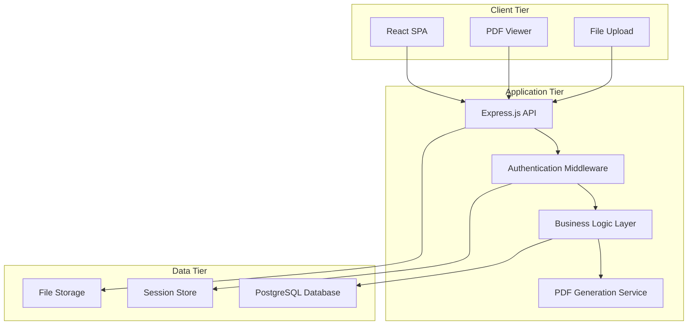

# Design Document

## Overview

The venue finding agency CRM is designed as a full-stack web application with a React frontend, Node.js/Express backend, and PostgreSQL database. The system follows a three-tier architecture with clear separation of concerns, RESTful API design, and role-based access control. The application prioritizes data integrity, user experience, and document generation capabilities.

## Architecture

### System Architecture



### Technology Stack

**Frontend:**

- React 18 with TypeScript
- Material-UI or Tailwind CSS for styling
- React Router for navigation
- React Query for state management and API caching
- React Hook Form for form handling
- PDF.js for PDF preview

**Backend:**

- Node.js with Express.js
- TypeScript for type safety
- Passport.js for authentication (Google/Microsoft OAuth)
- Joi or Zod for request validation
- PDFKit or Puppeteer for PDF generation
- Multer for file uploads

**Database:**

- PostgreSQL 14+
- Prisma ORM for database operations
- Database migrations for schema management

**Infrastructure:**

- JWT tokens for session management
- bcrypt for password hashing (if needed)
- Winston for logging
- dotenv for environment configuration

## Components and Interfaces

### Frontend Components

#### Core Layout Components

- `AppLayout`: Main application shell with navigation
- `Sidebar`: Navigation menu with role-based visibility
- `Header`: User profile, notifications, logout
- `Dashboard`: Main dashboard with metrics and quick actions

#### CRM Components

- `ClientList`: Paginated client listing with search/filter
- `ClientForm`: Add/edit client information
- `ClientDetail`: Client profile with proposals and bookings
- `VenueList`: Paginated venue listing with search/filter
- `VenueForm`: Add/edit venue information
- `VenueDetail`: Venue profile with booking history

#### Proposal Components

- `ProposalBuilder`: Multi-step proposal creation wizard
- `VenueSelector`: Multi-select venue picker with search
- `ChargeLineEditor`: Dynamic charge line management
- `ProposalPreview`: Preview before PDF generation
- `ProposalList`: Proposal management dashboard

#### Booking Components

- `BookingWorkflow`: Status progression interface
- `BookingDetail`: Comprehensive booking information
- `DocumentManager`: Upload/download booking documents
- `OptionTracker`: Option expiry alerts and management

#### Commission Components

- `CommissionClaims`: Claims management interface
- `ClaimGenerator`: Auto-generate commission invoices
- `PaymentTracker`: Track claim payment status

### Backend API Endpoints

#### Authentication

- `POST /auth/google` - Google OAuth callback
- `POST /auth/microsoft` - Microsoft OAuth callback
- `POST /auth/logout` - User logout
- `GET /auth/me` - Current user profile

#### Clients

- `GET /api/clients` - List clients with pagination/search
- `POST /api/clients` - Create new client
- `GET /api/clients/:id` - Get client details
- `PUT /api/clients/:id` - Update client
- `DELETE /api/clients/:id` - Delete client

#### Venues

- `GET /api/venues` - List venues with pagination/search
- `POST /api/venues` - Create new venue
- `GET /api/venues/:id` - Get venue details
- `PUT /api/venues/:id` - Update venue
- `DELETE /api/venues/:id` - Delete venue

#### Proposals

- `GET /api/proposals` - List proposals with filters
- `POST /api/proposals` - Create new proposal
- `GET /api/proposals/:id` - Get proposal details
- `PUT /api/proposals/:id` - Update proposal
- `DELETE /api/proposals/:id` - Delete proposal
- `POST /api/proposals/:id/pdf` - Generate proposal PDF

#### Bookings

- `GET /api/bookings` - List bookings with filters
- `POST /api/bookings` - Create booking from proposal
- `GET /api/bookings/:id` - Get booking details
- `PUT /api/bookings/:id` - Update booking status
- `POST /api/bookings/:id/documents` - Upload documents
- `GET /api/bookings/:id/confirmation` - Generate confirmation PDF

#### Commission Claims

- `GET /api/claims` - List commission claims
- `POST /api/claims` - Generate claim from booking
- `PUT /api/claims/:id` - Update claim status
- `GET /api/claims/:id/invoice` - Generate claim invoice PDF

#### Reporting

- `GET /api/reports/dashboard` - Dashboard metrics
- `GET /api/reports/pipeline` - Pipeline analysis
- `GET /api/reports/commission` - Commission summary

## Data Models

### Database Schema

```sql
-- Users table for authentication
CREATE TABLE users (
    id SERIAL PRIMARY KEY,
    email VARCHAR(255) UNIQUE NOT NULL,
    name VARCHAR(255) NOT NULL,
    role VARCHAR(50) NOT NULL DEFAULT 'consultant',
    provider VARCHAR(50) NOT NULL,
    provider_id VARCHAR(255) NOT NULL,
    created_at TIMESTAMP DEFAULT CURRENT_TIMESTAMP,
    updated_at TIMESTAMP DEFAULT CURRENT_TIMESTAMP
);

-- Clients table
CREATE TABLE clients (
    id SERIAL PRIMARY KEY,
    name VARCHAR(255) NOT NULL,
    company VARCHAR(255),
    contact_name VARCHAR(255),
    email VARCHAR(255),
    phone VARCHAR(50),
    notes TEXT,
    created_by INTEGER REFERENCES users(id),
    created_at TIMESTAMP DEFAULT CURRENT_TIMESTAMP,
    updated_at TIMESTAMP DEFAULT CURRENT_TIMESTAMP
);

-- Venues table
CREATE TABLE venues (
    id SERIAL PRIMARY KEY,
    name VARCHAR(255) NOT NULL,
    location VARCHAR(500),
    contact_name VARCHAR(255),
    email VARCHAR(255),
    phone VARCHAR(50),
    standard_commission DECIMAL(5,2) DEFAULT 0.00,
    notes TEXT,
    created_by INTEGER REFERENCES users(id),
    created_at TIMESTAMP DEFAULT CURRENT_TIMESTAMP,
    updated_at TIMESTAMP DEFAULT CURRENT_TIMESTAMP
);

-- Proposals table
CREATE TABLE proposals (
    id SERIAL PRIMARY KEY,
    client_id INTEGER REFERENCES clients(id) ON DELETE CASCADE,
    created_by INTEGER REFERENCES users(id),
    status VARCHAR(50) DEFAULT 'draft',
    total_value DECIMAL(10,2) DEFAULT 0.00,
    expected_commission DECIMAL(10,2) DEFAULT 0.00,
    notes TEXT,
    created_at TIMESTAMP DEFAULT CURRENT_TIMESTAMP,
    updated_at TIMESTAMP DEFAULT CURRENT_TIMESTAMP
);

-- Proposal venues junction table
CREATE TABLE proposal_venues (
    id SERIAL PRIMARY KEY,
    proposal_id INTEGER REFERENCES proposals(id) ON DELETE CASCADE,
    venue_id INTEGER REFERENCES venues(id) ON DELETE CASCADE,
    charge_lines JSONB DEFAULT '[]',
    commission_override DECIMAL(5,2),
    notes TEXT,
    created_at TIMESTAMP DEFAULT CURRENT_TIMESTAMP
);

-- Bookings table
CREATE TABLE bookings (
    id SERIAL PRIMARY KEY,
    proposal_id INTEGER REFERENCES proposals(id),
    client_id INTEGER REFERENCES clients(id),
    venue_id INTEGER REFERENCES venues(id),
    status VARCHAR(50) DEFAULT 'draft',
    option_expiry DATE,
    total_value DECIMAL(10,2) DEFAULT 0.00,
    commission_amount DECIMAL(10,2) DEFAULT 0.00,
    signed_docs JSONB DEFAULT '[]',
    created_by INTEGER REFERENCES users(id),
    created_at TIMESTAMP DEFAULT CURRENT_TIMESTAMP,
    updated_at TIMESTAMP DEFAULT CURRENT_TIMESTAMP
);

-- Commission claims table
CREATE TABLE commission_claims (
    id SERIAL PRIMARY KEY,
    booking_id INTEGER REFERENCES bookings(id) ON DELETE CASCADE,
    amount DECIMAL(10,2) NOT NULL,
    status VARCHAR(50) DEFAULT 'draft',
    sent_date DATE,
    paid_date DATE,
    invoice_number VARCHAR(100),
    notes TEXT,
    created_by INTEGER REFERENCES users(id),
    created_at TIMESTAMP DEFAULT CURRENT_TIMESTAMP,
    updated_at TIMESTAMP DEFAULT CURRENT_TIMESTAMP
);
```

### TypeScript Interfaces

```typescript
interface User {
  id: number;
  email: string;
  name: string;
  role: "admin" | "consultant";
  provider: string;
  providerId: string;
  createdAt: Date;
  updatedAt: Date;
}

interface Client {
  id: number;
  name: string;
  company?: string;
  contactName?: string;
  email?: string;
  phone?: string;
  notes?: string;
  createdBy: number;
  createdAt: Date;
  updatedAt: Date;
}

interface Venue {
  id: number;
  name: string;
  location?: string;
  contactName?: string;
  email?: string;
  phone?: string;
  standardCommission: number;
  notes?: string;
  createdBy: number;
  createdAt: Date;
  updatedAt: Date;
}

interface ChargeLine {
  id: string;
  description: string;
  quantity: number;
  unitPrice: number;
  total: number;
  category: "room_hire" | "food_beverage" | "av_equipment" | "other";
}

interface ProposalVenue {
  id: number;
  proposalId: number;
  venueId: number;
  venue: Venue;
  chargeLines: ChargeLine[];
  commissionOverride?: number;
  notes?: string;
}

interface Proposal {
  id: number;
  clientId: number;
  client: Client;
  createdBy: number;
  status: "draft" | "sent";
  totalValue: number;
  expectedCommission: number;
  venues: ProposalVenue[];
  notes?: string;
  createdAt: Date;
  updatedAt: Date;
}

interface Booking {
  id: number;
  proposalId: number;
  proposal: Proposal;
  clientId: number;
  client: Client;
  venueId: number;
  venue: Venue;
  status: "draft" | "proposal_sent" | "option" | "confirmed" | "completed";
  optionExpiry?: Date;
  totalValue: number;
  commissionAmount: number;
  signedDocs: string[];
  createdBy: number;
  createdAt: Date;
  updatedAt: Date;
}

interface CommissionClaim {
  id: number;
  bookingId: number;
  booking: Booking;
  amount: number;
  status: "draft" | "sent" | "paid" | "overdue";
  sentDate?: Date;
  paidDate?: Date;
  invoiceNumber?: string;
  notes?: string;
  createdBy: number;
  createdAt: Date;
  updatedAt: Date;
}
```

## Error Handling

### Frontend Error Handling

- Global error boundary for React component errors
- API error interceptors with user-friendly messages
- Form validation with real-time feedback
- Network error handling with retry mechanisms
- Loading states and error states for all async operations

### Backend Error Handling

- Centralized error handling middleware
- Structured error responses with consistent format
- Input validation with detailed error messages
- Database constraint error handling
- Authentication and authorization error responses
- File upload error handling with size and type validation

### Error Response Format

```typescript
interface ErrorResponse {
  success: false;
  error: {
    code: string;
    message: string;
    details?: any;
    field?: string; // for validation errors
  };
  timestamp: string;
  path: string;
}
```

## Testing Strategy

### Frontend Testing

- Unit tests for utility functions and hooks using Jest
- Component testing with React Testing Library
- Integration tests for user workflows
- E2E tests with Playwright for critical paths
- Visual regression testing for PDF generation

### Backend Testing

- Unit tests for business logic and utilities
- Integration tests for API endpoints
- Database testing with test database
- Authentication flow testing
- PDF generation testing
- File upload testing

### Test Coverage Goals

- Minimum 80% code coverage for backend
- Minimum 70% code coverage for frontend
- 100% coverage for critical business logic
- All API endpoints must have integration tests
- All user workflows must have E2E tests

### Testing Tools

- Jest for unit and integration testing
- React Testing Library for component testing
- Supertest for API testing
- Playwright for E2E testing
- Factory functions for test data generation
